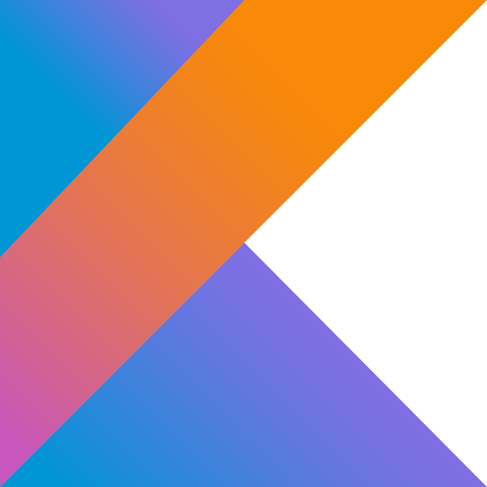

# INDUSTRIAL TALK (ASSIGNMENT 1)

On November 14th, 2023, I took part in an online industrial talk by Clarity Techworks.

* Yee Soon Tuck, the Chief Technology Officer,
* Mohamad Noor Ridwan bin Musa, Junior Android Developer,
* Syarifah Adiatul Hulwani binti Syed Mohamad Anis, Junior UI/UX Designer,
* Liyana Amri, QA Analyst,
* Saiful Habib Danial, Junior Web/API Developer, and
* Izzah Fatini binti Mohd Nasri, Junior Web/API Developer

were the speakers of this talk, arranged by Dr. Muhammad Iqbal Tariq Idris.

Promotional Poster for the Industrial Talk by UTM

### CONTENTS OF THE TALK

Yee Soon Tuck, the Chief Technology Officer of Clarity Techworks for over 33 years started off the industrial 
talk by explaining about their fintech company. One of their product is Rapidz Pay, which is a crypto payment
and digital assets ecosystem available on Google Play and the App Store. They practice Scrum methodology for their
works. Their tech stack includes:

The most important characteristics one should have especially when they want to be employed are
* Loves Tech
* Self-learner
* High Standards
* Highly-motivated
* Problem Solver
* Team Player
* Great Personality Integrity

Ms. Liyana, Ms. Syarifah, Mr. Ridwan, Ms. Izzah and Mr. Saiful gave wonderful sharing about their jobs at
Clarity Techworks and advice to aspiring future engineers if they want to succeed just like them. To summarise:

>Job Scopes are different for each role
>> For instance, Android Developers are assigned to do research, implement new features, resolve bug issues
>> and publish the app to stores, such as Google Play Store.

> Technology Usage
>> Web/API Developers used tech such as Postman to test APIs, Bitbucket to manage codes, Jira for task distribution
>> and Sequel Ace as the database.

> Essential Skills
>> To strive in this field, one should be analytical, excellent communication skills, creative, punctual,
>> and attention even for the smallest details.

> Work Life vs Student Life
>> When working, obviously it is more practical than it is theoretical. Since everyone in a company are deligated to
>> their own tasks on any projects, we must be independent and have to learn by ourselves, then ask questions
>> if we have any query regarding the project. We should also do less mistakes and own up to it if it happens.

### REFLECTION
Throughout this online industrial talk, I learned a lot especially the wide range of jobs when it comes to sofiware
engineering. Be it as an Android Developer or Web/API Developer, as long as I work hard and focus on my studies,
I can also achieve success just like the junior employees of Clarity Techworks. The most important aspect is that
I must be passionate about all things computer science, and to improve my skills overtime throughout my journey
in UTM.

## POSTER (ASSIGNMENT 1)

