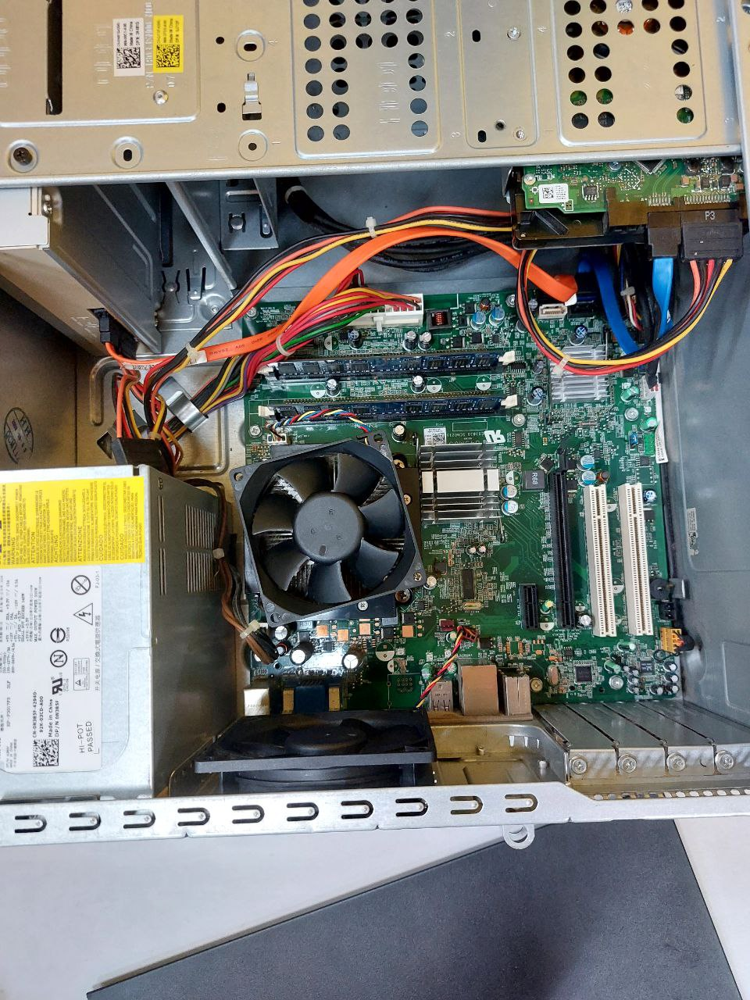

<html>
  

    <h1>PC ASSEMBLE (LAB)</h1>
      
    
During the PC Assemble session, I learned a lot regarding the interior of a PC and the necessary steps to both

    
assemble and disassemble the PC from opening the front cover to removing the fan or cooler of the CPU.

    
This session would have been more enjoyable if it also includes other components including GPUs and M.2 SSDs.

     
    
     
    
Having a quiz at the end of the session is perfect to recap the session of PC assembly.

    
I had fun throughout this activity!

  

</html>
